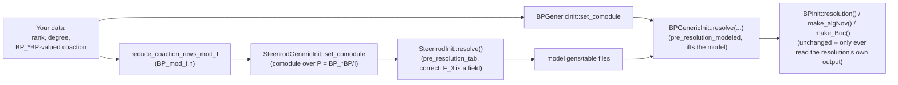

# Computing the E2 Page for a General Comodule

By default, this repo computes the algebraic Novikov E2 page only for the
**sphere**: `mr_BP` resolves the trivial `BP_*BP`-comodule `BP_*` itself (see
`docs/CODE_WALKTHROUGH.md` §3 for exactly where `set_to_trivial` builds
that). This page documents a new, additive capability — `BP_generic_init.h`/
`.cpp`, `Steenrod_generic_init.h`/`.cpp`, `BP_mod_I.h`/`.cpp`,
`comodules.h`/`.cpp`, and `mr_BP_comod.cpp` — for computing the same kind of
E2 page for **any** finitely generated `BP_*BP`-comodule `M` that is free
over `BP_*/I_n` for some `n ≥ 0` (e.g. the BP-homology of a finite complex),
given as a rank, a per-generator degree, a coaction matrix, and that `n`.
Here `I_n = (p, v_1, …, v_{n-1})`, so `n = 0` means free over `BP_*` itself;
`n ≥ 1` covers comodules like `BP_*(S/p) = BP_*/p` and
`BP_*(S/(p,v_1)) = BP_*/I_2`, which are free over no smaller quotient. See
[Comodules that are not free over `BP_*`](#comodules-that-are-not-free-over-bp_-heights)
below.

Comodules live in a **registry** (`comodules.cpp`) and are selected by name
on the command line:

```
./mr_BP_comod <halfT> <resolution_length> [comodule]   # default: sphere
./mr_BP_comod --list                                    # show what's available
```

Nothing in the existing pipeline is modified; this is purely additive.

## Why this isn't a one-line change

The obvious approach — build a `comodule_generic<BPBP,int>` from your own
data instead of calling `set_to_trivial`, then call
`Hopf_Algebroid::pre_resolution_tab` directly — **does not work**, and the
reason is worth understanding before using this:

`PolyOp::invertible(x)` (`polynomial/6.h:27-28`), which `curtis_table`'s
pivot-finding (`symplify_to_led`) relies on to decide whether a leading term
is "already accounted for," only recognizes an element as invertible if it's
a bare constant *and* that constant is itself invertible in the base ring.
For `BP = BP_* = Z_(3)[v_1,v_2,...]`, that means an element is invertible
only if it has **no `v_i`'s in it at all**. Almost anything a real coaction
produces (`η_R(v_1)`, anything genuinely involving the `v_i`'s) is never
invertible by this test — so the pivot search that `pre_resolution_tab`
relies on can't reliably find pivots when the ring is `BP_*` itself. This
isn't a corner case: it's why the *existing*, shipped `mr_BP` never calls
`pre_resolution_tab` with `ring=BP` at all — it exclusively uses the
"modeled" path (`pre_resolution_modeled`), which never searches for pivots
over `BP_*`; it reuses pivots already found on the `F_3` side (a genuine
field, where every nonzero element is invertible) and only *lifts* the
resulting values into `BP_*BP` via `BP_Op::lift`.

(This was found by testing, not just reasoning: an earlier version of this
feature that called `pre_resolution_tab` directly over `BP` compiled cleanly
but produced an empty algebraic Novikov page for the sphere, where the known
answer has several classes — a concrete illustration of why every nontrivial
change here should be checked against a case with an already-known answer,
not just compiled.)

## Is "reduce mod `I`, then resolve, then lift" new? No

It's tempting to read the two-phase approach below as a new architecture
introduced for the general case. It isn't — **the sphere's own E2-page
computation already works exactly this way**; see
`docs/CODE_WALKTHROUGH.md` §4.0 for the precise, function-by-function
trace. In brief: `BP_*` is the simplest possible `BP_*BP`-comodule (one
generator, coaction "1 times itself"), so its reduction mod `I` has a
one-line answer that doesn't need computing — that one-liner *is*
`set_to_trivial` (`hopf_algebroid/12.h:1-12`), called on the `P` side by
`mr_st` (`steenrod_init.cpp:32`). `mr_st` resolving that reduction and
`mr_BP` lifting it (`BP_init.cpp:43-54`) are phases 2 and 3 of the exact
same pattern used below. The only genuinely new piece for a general `M` is
`BP_mod_I.cpp`'s reduction functions — a real computation, because a general
`M`'s mod-`I` reduction isn't simple enough to hardcode by hand the way
`set_to_trivial` does for `BP_*` itself.

## The two-phase approach

1. **Reduce `M` mod `I = (p, v_1, v_2, ...)`** to get a comodule over
   `P = BP_*BP/I` — a genuine field-based Hopf algebra (`F_3[t_1,t_2,...]`).
   Since `M` is free over `BP_*`, this reduction is always well-defined, and
   it's exactly the general `M`/`M/I` language `MinimalResolution.pdf` §5
   already uses (not specific to `M = BP_*`). `BP_mod_I.h`'s
   `reduce_coaction_rows_mod_I` derives this automatically from your
   `BP_*BP`-valued coaction — you only enter your comodule's data once.
2. **Resolve that reduction with the classical (Steenrod-style) machinery**
   — `SteenrodGenericInit::set_comodule` + the inherited
   `SteenrodInit::resolve()`, i.e. `pre_resolution_tab` over `ring=Fp`. This
   *does* work correctly, since `F_3` is a field.
3. **Lift that resolution to `BP_*BP` via `pre_resolution_modeled`** —
   `BPGenericInit::set_comodule` + `BPGenericInit::resolve(model_gens_data,
   model_table_file)`, pointed at the files phase 2 wrote, exactly mirroring
   how `mr_BP` already lifts `mr_st`'s resolution for the sphere.



## Comodules that are not free over `BP_*`: heights

`BP_*(S/p) = BP_*/p` cannot be entered as a rank/degree/coaction triple at
all: `comodule_generic` has a rank and a basis over the base ring, and
`BP_*/p` has neither over `BP_*`. It *is* free of rank 1 over `BP_*/p`,
though, and that turns out to be enough.

The ideals `I_n = (p, v_1, …, v_{n-1})` are **invariant**, so
`(BP_*/I_n, BP_*BP/I_n)` is again a Hopf algebroid, with

```
BP_*/I_n   = F_p[v_n, v_{n+1}, …]
BP_*BP/I_n = (BP_*/I_n)[t_1, t_2, …]
```

and for a comodule `M` with `I_n M = 0` the cobar complexes agree term by term
(`BP_*BP ⊗_{BP_*} M = (BP_*BP/I_n) ⊗_{BP_*/I_n} M`), giving the
change-of-rings isomorphism

```
Ext_{BP_*BP}(BP_*, M)  ≅  Ext_{BP_*BP/I_n}(BP_*/I_n, M).
```

So the recipe is simply to run the whole computation over the quotient Hopf
algebroid. Each comodule records which one as its **height** `n`
(`ComoduleSpec::height` in `comodules.h`); `n = 0` is the classical case and
is what every pre-existing comodule uses, bit for bit.

### Why this costs almost nothing

Because `(BP_*BP/I_n) / (I/I_n) = BP_*BP/I = P` for **every** `n`: the
field-side model of phase 1 is over the same `P` whichever quotient you are
resolving over. Phase 1, `reduce_coaction_rows_mod_I`, and the
`pre_resolution_modeled` lift of phase 2 are all untouched. Only the ring the
lift happens over changes:

| | height 0 | height `n ≥ 1` |
|---|---|---|
| base ring | `BP_* = Z_(p)[v_1, v_2, …]` | `BP_*/I_n = F_p[v_n, v_{n+1}, …]` |
| coefficients | `Z3_Op` (characteristic 0) | `Z3_mod_p_Op` (characteristic `p`) |
| `v_1 … v_{n-1}` | present | killed |
| primitive basis | all `v`-monomials | monomials in `v_n, v_{n+1}, …` only |
| algNov filtration | `val_p(coefficient) + #v`'s | `#v`'s (`p` is `0`) |
| Bockstein | `v_0 = p` | `v_n` |
| `a_0` table | multiplication by `p` | multiplication by `v_n`, in `AANSS_a<n>.txt` |

Two facts keep this small rather than a rewrite:

* **Characteristic `p` is a property of the coefficient ring alone.** Every
  ring operation on `BP` and `BPBP` runs through a `RingOp<Z3>*`, so
  substituting `Z3_mod_p_Op` when `BPInit` is constructed turns `BP_*` into
  `BP_*/p` everywhere above it. A second coefficient *type* would have been
  the wrong move: `polynomial<Fp>` is already taken — it is `P` — and
  `matrix<P>::moduleOper` is a static that both halves of `mr_BP_comod` share
  inside one process.
* **Killing `v_1, …, v_{n-1}` is reduction modulo a *monomial* ideal**, so the
  reduced elements are closed under `+` and `×`. Reducing the three structure
  tables as they are read (`BP_Op::load_etaL`/`load_R2L`/`load_delta`) and the
  supplied coaction (`BPGenericInit::set_comodule`) is therefore enough to
  keep every product the resolution engine forms reduced as well. No ring
  operation needs overriding.

The structure tables do **not** need regenerating: `η_R(I_n) ⊆ I_n·BP_*BP`
because `I_n` is invariant, so what `BPtab` already wrote reduces entrywise.
One `BPtab <t>` run serves every height.

### What you have to get right

- **`h_0`.** `BP_Op::h0()` computes `(η_R(v_1) − η_L(v_1))/p`, which is `0/p`
  in characteristic `p`: the two units agree mod `p`, so the difference
  vanishes before the division happens, and dividing by `p` is not an
  operation `BP_*/I_n` has. It detects this and builds `t_1` directly instead
  (`BP_Op::t1()`, bitwise equal to `h0()` at height 0).
- **The height itself.** Nothing checks it, in *either* direction. Too small
  and the machinery treats a module that is not free over `BP_*/I_n` as
  though it were, and the answer is nonsense. Too large and you get a
  perfectly self-consistent run of the wrong computation: `Ext(BP_*, M/I_n)`
  rather than `Ext(BP_*, M)` — declaring the `sphere` at `n = 1` quietly
  computes the E2 page of `S/p`. State `n` from a proof that the module is
  free over `BP_*/I_n` and over nothing larger.

## How to use it

Build once, then pick a comodule by name:

```
sh BP_comod_compile
./BPtab 20                      # same prerequisite as mr_BP; one run serves every height
./mr_BP_comod 20 4              # the sphere (default)
./mr_BP_comod 20 4 alpha_1      # S/alpha_1
./mr_BP_comod 20 4 mod_p        # S/p, free over BP_*/p rather than over BP_*
./mr_BP_comod 20 4 mod_p_v1     # S/(p,v_1) = V(1)
./mr_BP_comod --list            # what's available, with each comodule's height
```

Output is prefixed `<halfT>_<comodule>BP...` for the final resolution and its
`algNov`/`Boc` tables, and `<halfT>_<comodule>P...` for the mod-`I` model
resolution — so different comodules, and a plain `mr_st`/`mr_BP` run, all
coexist in one directory without clobbering each other.

### Shipped comodules

| name | complex | `n` | rank | degrees | coaction |
|---|---|---|---|---|---|
| `sphere` (default) | `S` | 0 | 1 | `0` | `ψ(x_0) = 1 ⊗ x_0` |
| `alpha_1` | `S/α₁ = cofib(S³ → S⁰)` | 0 | 2 | `0, 4` | `ψ(x_0) = 1 ⊗ x_0`, `ψ(x_4) = 1 ⊗ x_4 + t_1 ⊗ x_0` |
| `triv_01` | `S ∨ S¹` | 0 | 2 | `0, 1` | identity: `ψ(x_i) = 1 ⊗ x_i` |
| `mod_p` | `S/p` | 1 | 1 | `0` | `ψ(x_0) = 1 ⊗ x_0` |
| `mod_p_v1` | `S/(p,v_1) = V(1)` | 2 | 1 | `0` | `ψ(x_0) = 1 ⊗ x_0` |
| `alpha_1_mod_p` | `S/α₁ ∧ S/p` | 1 | 2 | `0, 4` | as `alpha_1` |

`mod_p` and `mod_p_v1` have the *trivial* coaction for the same reason the
sphere does: each is the base ring of its own Hopf algebroid, and the unit is
always primitive. All the content sits in `η_R`, which lives in the reduced
structure tables, not in the coaction matrix. `alpha_1_mod_p` is the one
shipped comodule that is simultaneously of height > 0, rank > 1, and has a
nonzero off-diagonal entry, so it is the only one exercising the height
machinery and the general-coaction machinery at once.

`triv_01` is split (`BP_*(S ∨ S¹) = BP_* ⊕ ΣBP_*`), which makes it a useful
self-test of the rank > 1 machinery: since `Ext` takes direct sums to direct
sums, its E2 page must be *exactly* two copies of the sphere's, one shifted
one step along the stem — see "A sanity check with mathematical content"
below. It also exercises odd-degree bookkeeping, which neither the sphere nor
`alpha_1` touches (everything in `BP_*` sits in even degrees).

### Adding your own

Two steps, both in `comodules.cpp`, and nothing else in the program changes:

1. Write a builder function setting `rank`, `degree`, and `coaction_rows`,
   and give its table row a **height** (the last field). Use `0` if the
   underlying module is free over `BP_*`, `1` if only over `BP_*/p`, `2` if
   only over `BP_*/(p,v_1)`, and so on. At height `n > 0` write the coaction
   in `BP_*BP/I_n` — in practice that means writing exactly what you would
   have written over `BP_*BP`, since `BP_oper` is already reducing mod `I_n`
   by the time your builder runs and `set_comodule` reduces again.
   `coaction_rows(i)` returns generator `i`'s coaction as a sparse
   `vectors<matrix_index,BPBP>` — a list of `(j, c)` pairs, `j` the index of
   another generator (`0..rank-1`), `c` a `BP_*BP` element built with
   `BP_oper.BPBP_opers`'s ring operations (`.unit(1)`, `.add(x,y)`,
   `.multiply(x,y)`, …). Read the warning directly below before writing any
   coefficient by hand.
2. Add one row to `comodule_table` at the bottom of the file.

Degrees are **full topological degrees**, the same units `exponents.cpp`'s
`xnDegs` uses: `|v_n| = |t_n| = 2(3ⁿ−1)`, so `|v_1| = |t_1| = 4` at `p=3`.

`BP_oper`'s structure tables are already loaded when your builder runs, so
`BP_oper.h0()` (`= t_1`) and `BP_oper.thetas()` (`= β₁`, …) are available —
these are the standard connecting-homomorphism constructions
(`α₁ = δ(v_1/p)`, `β₁ = δ(v_2/v_1)`) and are the safest way to get hold of
the cobar cocycles you'll need as off-diagonal entries.

### Warning: `BPBP`'s two exponent slots are not what you'd guess

`BPBP = polynomial<BP>` is **not** "polynomial in the `t_i` with `BP_*`
coefficients" in the layout the type name suggests. Per `BP.cpp:69` — *"the
right unit, `vn` is in the outer"* — it is the other way around:

- the **outer** exponent indexes the `v_i` (included via the **right** unit
  `η_R`), and
- the **inner** (coefficient) `BP`'s exponent indexes the `t_i`.

So `BPBP_opers.monomial(singleVar(1,1), unit(1))` — the obvious-looking way
to write `t_1` — is actually **`η_R(v_1)`**. The correct `t_1` is

```cpp
// t_1: outer exponent 0 (no v's), inner coefficient carrying t-exponent 1
BP   inner = BP_oper.monomial(singleVar(1,1), BP_oper.Z3_oper->unit(1));
BPBP t1    = BP_oper.BPBP_opers.monomial(0, inner);
```

Better still, for `t_1` specifically, just call **`BP_oper.h0()`**, which the
repo already provides: it computes `(η_R(v_1) - η_L(v_1))/p` from the loaded
structure tables, which is exactly `t_1`, and it can't be gotten backwards.
(Verified: `h0()` and the two-line construction above are bitwise equal, and
both differ from `BPBP_opers.monomial(singleVar(1,1),unit(1))`.)

This matters because getting it backwards fails *silently* in a particularly
nasty way: `η_R(v_1)` is not in the augmentation ideal, so a coaction using it
violates counitality — and, per the caveats below, nothing checks that.

**The same trap caught the reduction itself.** `reduce_BPBP_mod_I`
(`BP_mod_I.cpp`) was written for the layout the type name suggests — inner
slot = `BP_*` coefficients, outer = the `t_i` — and so read both slots
backwards: it reduced `t_1` to **0** and `η_R(v_1)` to **`t_1`**. Since every
off-diagonal coaction entry is a polynomial in the `t_i`, that silently
handed phase 2 a *split* comodule, i.e. the mod-`I` model of `S⁰ ∨ S⁴` in
place of the one for `S/α₁`. Two values pin the convention down and are worth
re-checking after any change to that file:

| input | must reduce to |
|---|---|
| `BP_oper.h0()` (= `t_1`) | `t_1` |
| `BPBP_opers.monomial(singleVar(1,1), unit(1))` (= `η_R(v_1)`) | `0` — `I` is invariant, so `η_R(I) ⊆ I·BP_*BP` |

The `sphere` regression below cannot catch this (its coaction is `1`, which
reduces correctly either way), and in the `S/α₁` case the final `Ext` came
out right anyway — the BP-side lift uses the true `BP_*BP` coaction and the
model only guides the generator search, so the damage was confined to how the
resolution's generators got indexed. That is luck, not a guarantee.

## Verifying a change here

Because resolving the trivial comodule through this path should produce
*exactly* the same answer as the existing `mr_BP` (they're computing the
same thing, `Ext_{BP_*BP}(BP_*,BP_*)`, just via different code paths), the
`sphere` comodule — the default — is a real regression test, not a smoke
test. Run both and diff:

```
./mr_st 20 5 && ./BPtab 20 && ./mr_BP 20 4     # reference
./mr_BP_comod 20 4                              # same thing, generic path
diff 20_BPAANSS_table.txt 20_sphereBPAANSS_table.txt
diff 20_BPBocSS_table.txt 20_sphereBPBocSS_table.txt
```

Both are currently byte-identical (as are the `_binary` and `_a0.txt`
variants), at `halfT=20`/`length=4` and at two smaller ranges including one
with a nontrivial differential. This comparison is how the original
from-scratch-over-`BP` approach was caught as incorrect. If you change
anything in `BP_generic_init.*`, `Steenrod_generic_init.*`, or `BP_mod_I.*`,
re-run it before trusting the result on a real complex.

### A sanity check with mathematical content

Diffing against the sphere only tests the plumbing. For a check that the
*comodule data itself* is right, look for something the topology predicts.
For `alpha_1`: coning off `α₁` should kill it, so the class the sphere has
in stem 3, filtration 1 must be absent from `S/α₁`:

```
grep -c "deg=(3,1)" 20_sphereBPAANSS_table.txt    # 1  -- alpha_1 itself
grep -c "deg=(3,1)" 20_alpha_1BPAANSS_table.txt   # 0  -- killed, as it must be
```

For `triv_01` the prediction is sharper still, and needs no topology input:
`Ext` takes direct sums to direct sums, so its page must be exactly the
sphere's page plus a copy of it shifted one step along the stem — for every
sphere class at `deg=(a,b)`, classes at `(a,b)` and `(a+1,b)`, and nothing
else. At `halfT=20, length=4` that holds exactly: 11 sphere classes → 22,
with the degree multiset matching term for term, and the single `d2`
doubling to two.

Both of these are one-line versions of a check that can be made complete.
For a two-cell complex the cofiber sequence pins down the *whole* page from
the sphere's, bidegree by bidegree — the connecting map of the long exact
sequence is multiplication by the class detecting the attaching map, which
is where the non-split comodule structure enters. `ses_check.py` runs that
comparison automatically (`./ses_check.py 35 -c alpha_1`); see
[`SES_CHECK.md`](SES_CHECK.md).

Find the analogous prediction for your own complex before trusting its
output; it is the only check that can catch a wrong coaction matrix, since
nothing verifies the comodule axioms.

### Checks for a height > 0 run

Three predictions, of increasing strength, and what they currently give.

**1. `Ext^0` is the ring of invariants of the base ring.** For `BP_*/I_n`
that is `F_p[v_n]`, so filtration 0 must be exactly one class in each of the
stems `0, |v_n|, 2|v_n|, …` and nothing else. At `t = 30`, `length = 8`:

```
mod_p     Ext^0 = 1, v1, v1^2, …, v1^7   at stems 0, 4, 8, …, 28   (|v_1| = 4)
mod_p_v1  Ext^0 = 1, v2                  at stems 0, 16            (|v_2| = 16)
```

both exactly as predicted, and `grep -c "v1\^" 30_mod_p_v1BPAANSS_*.txt`
returns `0` — `v_1` really is gone at height 2. This is the check that fails
loudly if the freeness bookkeeping (the primitive basis, the table
reduction) is wrong. Compare the sphere, where `Ext^0` is instead the
`v_0`-tower `1, v0, v0^2, …` in stem 0 alone: that contrast is the whole
difference between `Z_(p)` and `F_p` showing up in the output.

**2. `α₁` behaves.** `mod_p` has a class at `deg=(3,1)` (that is `α₁`);
`alpha_1_mod_p`, which cones it off, has none — the same one-line check as
for `alpha_1` above, one height up.

**3. The cofiber long exact sequence, bidegree by bidegree.** `ses_check.py`
takes the base run's prefix with `-s`, so it will compare a height-`n`
two-cell complex against the height-`n` *one-cell* run rather than against
the sphere:

```
./BPtab 30
./mr_BP_comod 30 8 mod_p
./mr_BP_comod 30 8 alpha_1_mod_p
./ses_check.py 30 -c alpha_1_mod_p -s 30_mod_pBP
```

`0 → BP_*/p → BP_*(S/α₁ ∧ S/p) → Σ⁴BP_*/p → 0` has connecting map `α₁`, so
this is the same shape of comparison the script was written for, with
`BP_*/p` in place of `BP_*`. It currently reports **26 bidegrees in
agreement, 23 of them with the prediction pinned down exactly, 0
mismatches** — which checks the height machinery and the rank > 1 coaction
machinery simultaneously, against an independent computation. (The script
prints "vs sphere" in its header regardless; the `-s` prefix is what it
actually read.)

## Caveats

- **No comodule-axiom verification.** Nothing here checks that the coaction
  you supply actually satisfies coassociativity or counitality. A mistake
  won't crash — it will silently produce a wrong `Ext` computation.
  `set_comodule` only checks that your data is structurally well-formed
  (indices in range, rows sorted).
- **Same degree-range and generator-count limits as the rest of the
  pipeline** — bounded by `max_degree`/`monomial_index`, and by the shared
  `exponents.h` table's generator cap (`v_1..v_5`/`t_1..t_5`), exactly as for
  the sphere computation.
- **"Free over `BP_*/I_n`" is assumed, not checked**, and neither is `n`
  itself. This matches the framework's blanket assumption throughout
  (`comodule_generic` has no notion of torsion), per `MinimalResolution.pdf`
  Definition 1. See "What you have to get right" above for what each kind of
  mistake looks like.
- **Only the invariant *prime* ideals `I_n` are available.** `S/p^k` and
  `S/(p, v_1^k)` for `k > 1` have `BP`-homology that is a module over an
  invariant quotient too — `(p^k)` and `(p, v_1^k)` are invariant ideals —
  but those quotients are not polynomial rings, so they would need a
  truncated multiplication rather than just a reduction, closer to what
  `trunc_hopf.cpp` does. The height is an integer `n` today, not a general
  invariant ideal.
